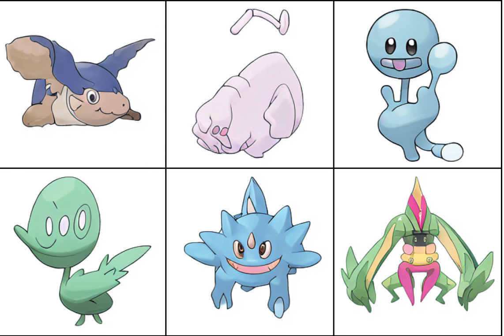
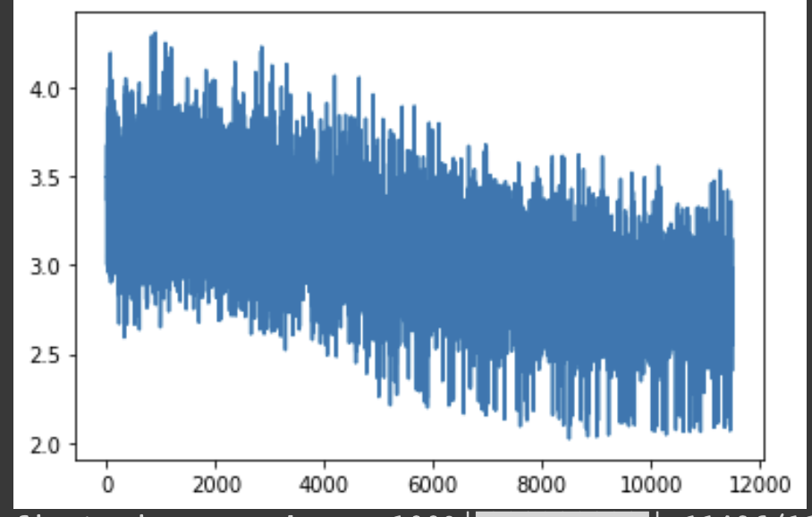

# ai-generated-pokemon-rudalle



Python script to preprocess images of all Pokémon (the "official artwork" of each Pokémon via [PokéAPI](https://pokeapi.co)) into a format such that it can be used to finetune [ruDALL-E](https://github.com/sberbank-ai/ru-dalle) using the finetuning example Colab Notebook [linked in that repo](https://colab.research.google.com/drive/1Tb7J4PvvegWOybPfUubl5O7m5I24CBg5?usp=sharing). This workflow was used to create a model that resulted in AI-Generated Pokemon that went viral ([10k+ retweets](https://twitter.com/minimaxir/status/1470913487085785089) on Twitter + [30k+ upvotes](https://www.reddit.com/r/pokemon/comments/rgmyxp/i_trained_an_ai_on_all_the_official_pokemon/) on Reddit)

My modified Colab Notebook that I used to finetune the model on Pokémon is [here](https://colab.research.google.com/drive/1EnDbU9iUoQ_NmMc69HO29xmbKBxpdzJ7?usp=sharing): this Notebook's release is purely for demonstration/authentication purposes and **no support will be given on how to use it** because it is incredibly messy and embarrassing, but there may be a few ideas there that are useful for future generation. Some notes on how the process works are included below, with oppertunity to reproduce/improve it.

The script outputs two things: an `images` folder with all the preprocessed images plus a `data_desc.csv` file which contains the image path and Russian caption pairs for finetuning. Some examples of the preprocessed input images are present in the `images` folder, plus the final `data_desc.csv`.

The model used is not included in this repo because it's currently too large (~3GB) to distribute (will add the model to Hugging Face at some point).

## Preprocessing Script Notes

- The GraphQL interface to PokéAPI is used as it allows to retrieve the type information plus IDs of all Pokémon in a single request. As a bonus, the returned IDs include the alternate forms of Pokémon (e.g. Mega) which would not otherwise be present just by incrementing IDs.
- ruDALL-E requires 256x256px, RGB input images. In this case the source input images from PokéAPI are conveiently both square and larger than 256x256 so they downsample nicely. Since the images have transparency (RGBA), they are composited onto a white background.
- The translation service used is [Yandex](https://translate.yandex.com), which apparently has decent rate limits, plus as a Russian company the translations from English to Russian should theoetically be better.
- The captions (which are later translated into Russian) are determined by type. For example, a Grass/Poison type will have the caption `A Grass-type and Poison-type Pokémon`, which is then translated into Russian. In theory, this improves the finetuning process by allowing ruDALL-E to notice trends, plus _in theory_ this can be leveraged at generation-time to control the generation (e.g. prompt with `A Grass-type Pokémon` and have ruDALL-E generate only Grass-type Pokémon)
- Due to potential rate limits on translation, translations are cached at runtime by Pokémon type(s) so the API is pinged only once.

## Finetuning and Generation Notes

- The model used above was trained for 12 epochs (4.5 hours on a P100), at a max learning rate of `1e-5`. The `pct_start` param of the `OneCycleLR` scheudler was set to `0.1` so that learning rate decay happens faster. Despite that, the model converged quickly.



- The parameters for finetuning ruDALL-E are very difficult to get the expected results. Too little training and the output images will be too incoherent; too much training and the model will overfit and output the source images, and also ignore any text prompts. In the social media posts above, the model is slightly overfit and attempts at using text prompts to control generation failed. But overfitting is not necessairly a bad thing as long as it avoids verbatim output.

## Usage

You can install the dependences via:

```sh
pip3 install Pillow requests translatepy tqdm
```

Then run `build_image_dataset.py`

Getting the images into the ruDALL-E finetuning Colab Notebook is up to the user, but the recommended way to do so is to ZIP the generated `images` folder (~42 MB!), upload it to Colab (or upload to Google Drive and copy it into the Notebook from there), and unzip the folder in Colab itself via `!unzip`.

## Maintainer/Creator

Max Woolf ([@minimaxir](https://minimaxir.com))

_Max's open-source projects are supported by his [Patreon](https://www.patreon.com/minimaxir) and [GitHub Sponsors](https://github.com/sponsors/minimaxir). If you found this project helpful, any monetary contributions to the Patreon are appreciated and will be put to good creative use._

## License

MIT
